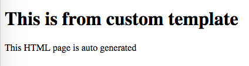

JavaScript Webpack Embed Code in Template Demo
==============================================

如何把webpack生成的script以非常精准的方式插入到html中的某个位置？

通过一个自定义的webpack插件`webpack-base64-generated-script-plugin.js`，
我们可以在`HtmlWebpackPlugin`插件生成了HTML文件但是还没有输出的时候，修改它的内容。

为了让生成的script不会因为引号或者其它符号问题导致插入后有语法错误，所以我们需要先对它进行base64转码，
插入到html后，再用`atob`对它进行解码，再使用`eval`执行即可。

注意，自定义的插件依赖于`HtmlWebpackPlugin`，所以要放在其后面。

同时需要注意在`HtmlWebpackPlugin`中，`inject`必须为`false`。如果为`true`，则会在生成的html最后再inject一个`bundle.js`。

```
npm install
npm run demo
```

它将会生成`index.html`并在浏览器中打开。可以结合模板看一下生成的html的内容。


